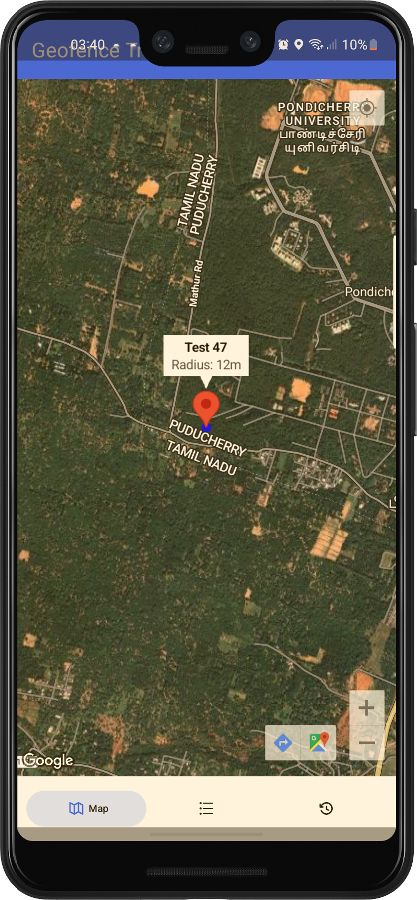
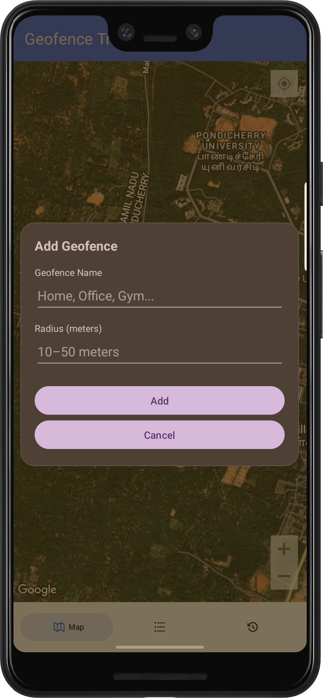
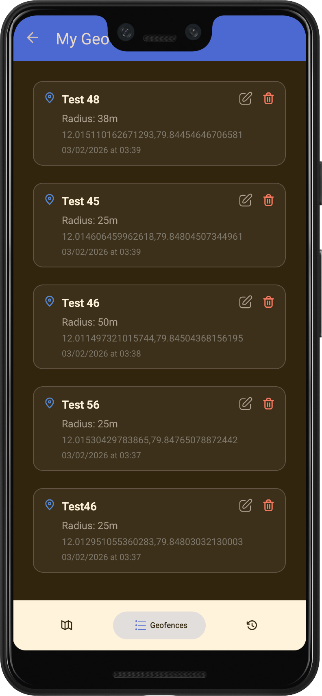
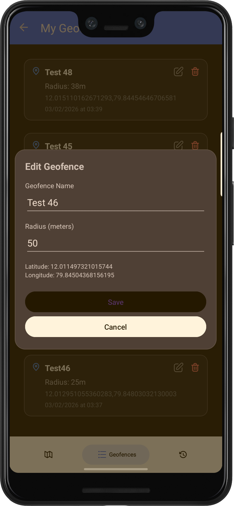
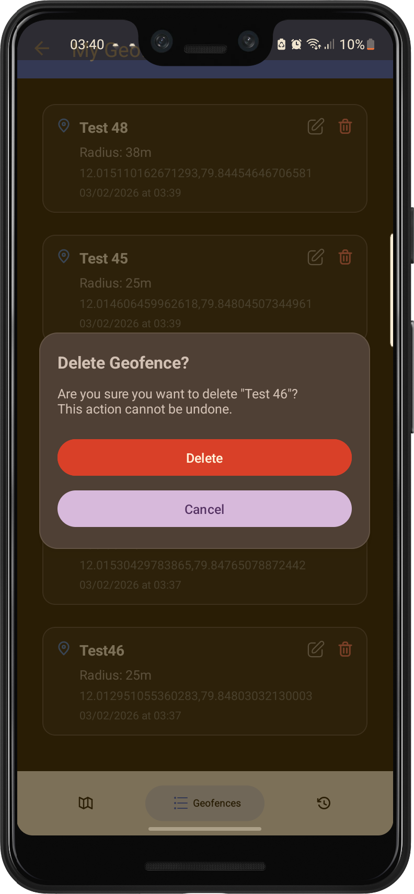
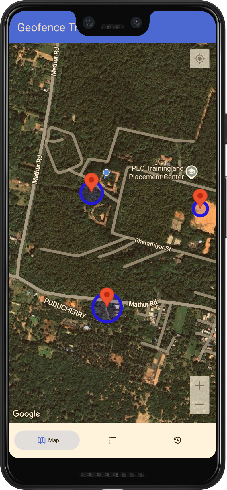
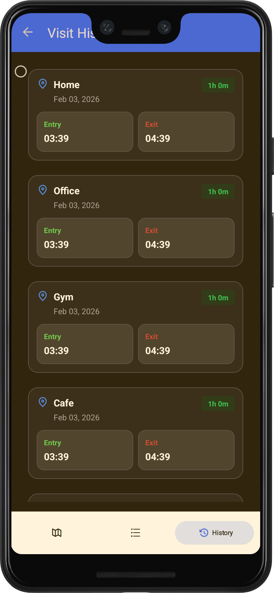
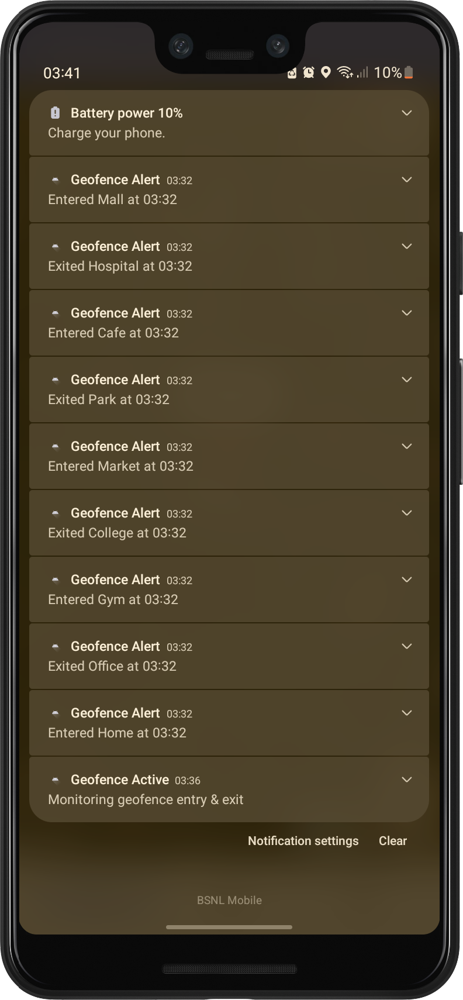

# 📍 GeoFence Tracker

> An Android application that enables location-based geofencing to track entry, exit, and time spent at specific locations.  
> Built as a technical assignment and designed to scale into a real-world safety and tracking solution.

---

## ▶️ Demo Video
https://github.com/user-attachments/assets/f56ef880-5944-4e1f-b8cb-b46969228a2e

> 📌 The demo video is stored locally inside the `Demo/` folder so it plays directly on GitHub.

---

## 📖 About the Project

GeoFence Tracker is an Android application that allows users to create location-based geofences and automatically track **entry**, **exit**, and **time spent** within those locations. The app stores visit history locally and works reliably on **Android 10 (API 29) and above**.

This project focuses on real-world Android concepts such as background location tracking, geofencing, permissions handling, and data persistence.

---

## 📱 Screenshots (App Flow)

<table>
  <tr>
    <td align="center">
       
      <b>Home / Map</b>
    </td>
    <td align="center">
       
      <b>Add Geofence</b>
    </td>
    <td align="center">
       
      <b>Geofence List</b>
    </td>
    <td align="center">
       
      <b>Edit Geofence</b>
    </td>
  </tr>
  <tr>
    <td align="center">
       
      <b>Delete Geofence</b>
    </td>
    <td align="center">
       
      <b>Persistence</b>
    </td>
    <td align="center">
       
      <b>Visit History</b>
    </td>
    <td align="center">
       
      <b>Notification</b>
    </td>
  </tr>
</table>

---

## 🚀 Features

- 📌 Add geofences on a map using long-press
- 📏 Configurable geofence radius (10m – 50m)
- 📍 Detect user **entry and exit** from geofenced locations
- ⏱️ Calculate **duration spent** inside a geofence
- 💾 Store geofence and visit data using Room Database
- 🔔 Notifications on geofence entry and exit
- 🗂️ View:
  - List of all geofenced locations
  - Visit history with entry time, exit time, and duration
- 🔄 Geofences persist even after app restart
- ⚙️ Reliable background execution (Android 10+)

---

## 🛠️ Tech Stack

- **Language:** Kotlin  
- **UI:** XML Layouts  
- **Architecture:** MVVM  
- **Database:** Room Database  
- **Maps & Location:** Google Maps SDK, Geofencing API  
- **Minimum Android Version:** Android 10 (API 29)

> ℹ️ Jetpack Compose is not used in the current version for stability and wider compatibility.  
> Migration to Jetpack Compose is planned in a future iteration.

---

## 🔐 Permissions Used

- `ACCESS_FINE_LOCATION`
- `ACCESS_BACKGROUND_LOCATION`
- `POST_NOTIFICATIONS` (Android 13+)

These permissions ensure accurate geofence detection, background tracking, and user notifications.

---

## 🧪 Tested On

- Android 10 and above
- Real Android devices
- Background execution scenarios
- App restart and geofence persistence

---

## 🔮 Future Improvements

- Migrate UI to Jetpack Compose
- Edit existing geofence radius
- Export visit history
- UI/UX enhancements
- Cloud sync & multi-device support

---

## 🔮 Future Upgrade: Child Tracking & Safeguarding App

This application is designed as a **scalable foundation** for a **Child Safety & Location Tracking App**.

### Planned Enhancements
- Real-time child location tracking
- Safe zones (Home, School, Playground)
- Alerts on zone entry/exit
- SOS emergency button
- Location history and time-spent analytics
- Secure cloud backend with authentication

> ✅ The current architecture supports this evolution without major refactoring.

---

## 📄 License

This project is licensed under the **MIT License**.

---

## 👤 Author

**Shivam Kumar**

## 🤝 Get in Touch

🌐 https://shivamkumarptu.github.io/Business-Site/

---

> ⭐ This project demonstrates real-world Android development, background location handling, and product-oriented thinking.
